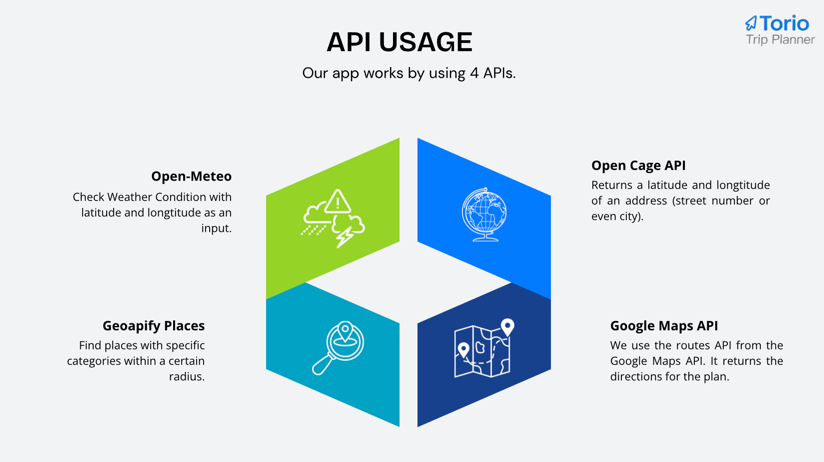
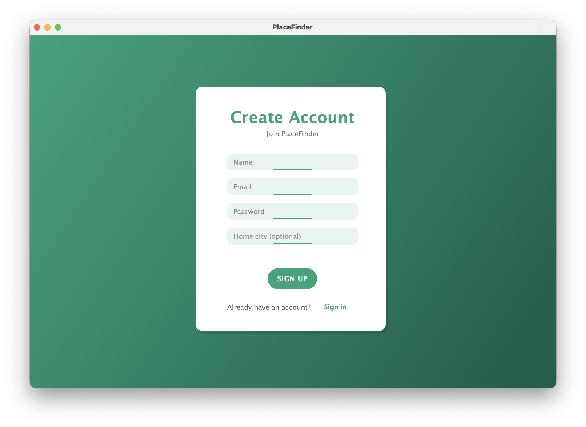
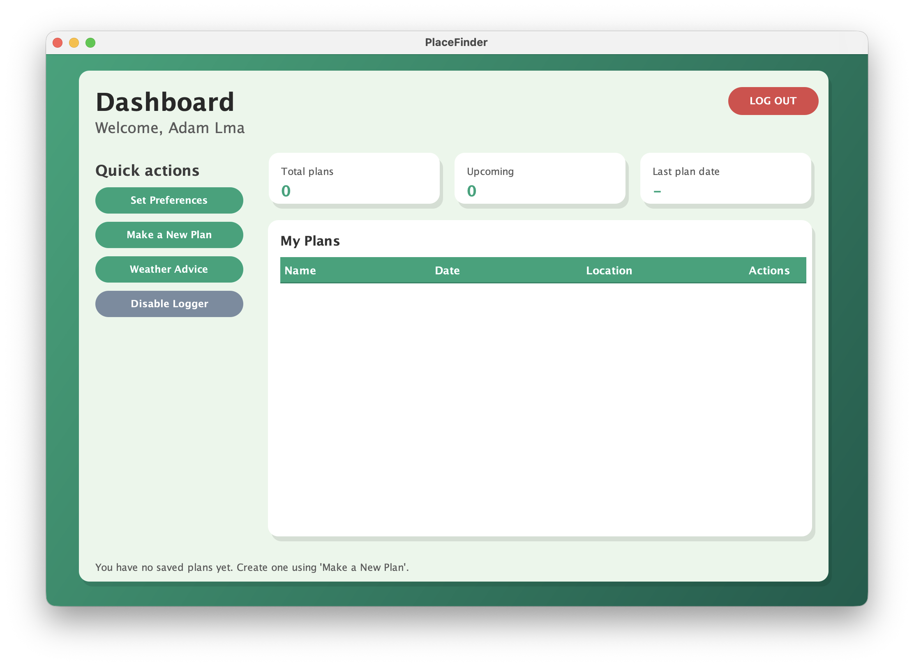
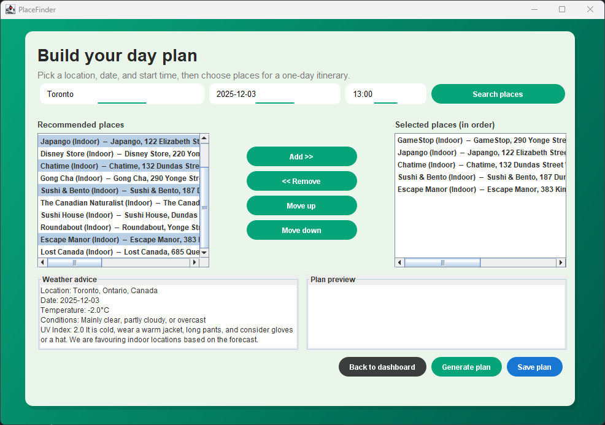
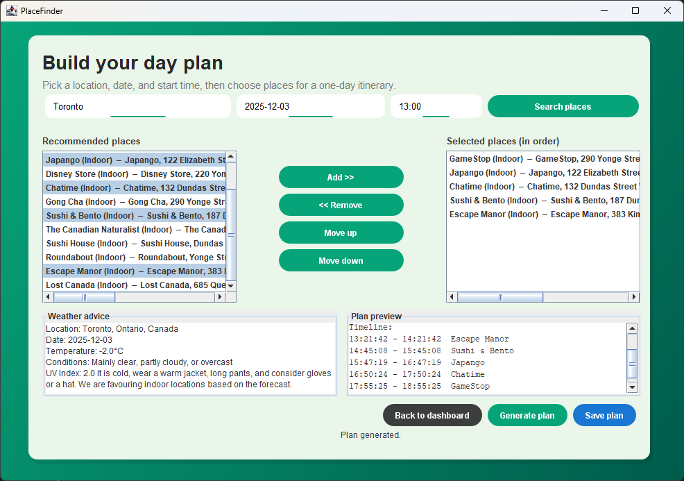
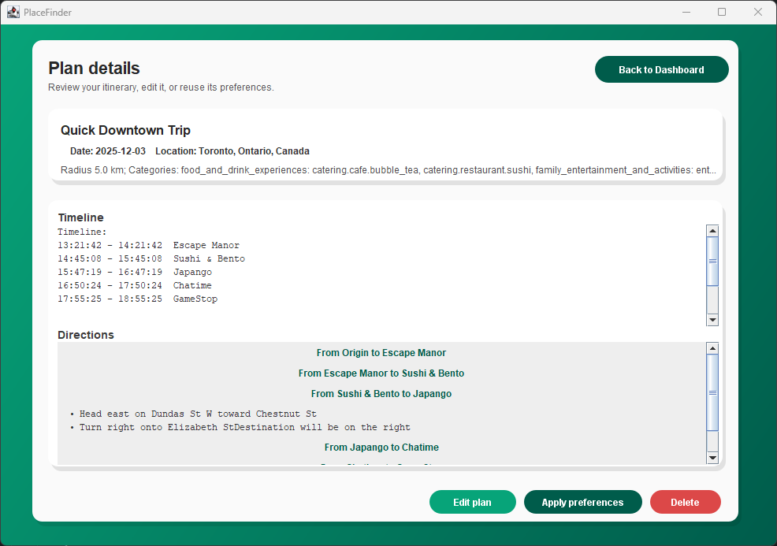

# Team Project

Please keep this up-to-date with information about your project throughout the term.

The readme should include information such as:
- a summary of what your application is all about
- a list of the user stories, along with who is responsible for each one
- information about the API(s) that your project uses 
- screenshots or animations demonstrating current functionality

By keeping this README up-to-date,
your team will find it easier to prepare for the final presentation
at the end of the term.

📍 Torio (PlaceFinder)

Torio is a one-day trip planning application that automatically generates a personalized travel itinerary for users based on location, preferences, radius, date, and available travel time.

Instead of manually researching attractions, weather data, and directions, the app retrieves real locations using an external API, optionally incorporates weather conditions when available, and then builds a complete day trip plan including recommendations, routing, and timing.

Users can create an account, verify email ownership, log in securely, generate day-trip plans, view previous plans, and save or delete itineraries for future use.

Core Features:

- User registration + login system

- Email verification via SMTP security code

- Search places based on user input and preferences

- Weather-aware suggestion engine (when data available)

- Generate structured travel itinerary automatically

- Save generated plans to user account

- View, list, and delete plans

- Route ordering + navigation logic for efficient travel

APIs Used:

- Open-Meteo: Check Weather Condition with latitude and longtitude as an input.
- Geoapify Places: Find places with specific categories within a certain radius.
- Open Cage API: Returns a latitude and longtitude of an address (street number or even city).
- Google Maps API: We use the routes API from the Google Maps API. It returns the directions for the plan.

App Screenshots:

| Team Member | Implemented Features                                                    |
| ----------- |-------------------------------------------------------------------------|
| **Jacob**   | Login, registration, weather-based travel advice                        |
| **Ariel Tantra** | Place recommendation based on user preferences + weather support   |
| **John**    | Save plan feature & plan generation logic from user inputs              |
| **Adam**    | Implements logging for Places API calls, including Quick Actions toggle |
| **Sean**    | Routing, trip sequencing, and navigation flow                           |
| **Subhan**  | Email verification system, list plans, view plan details, delete plans  |
